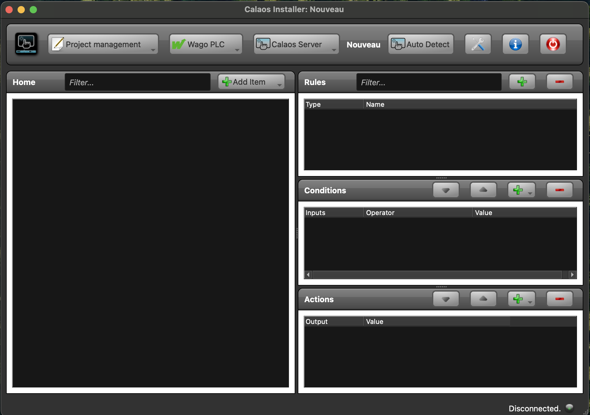
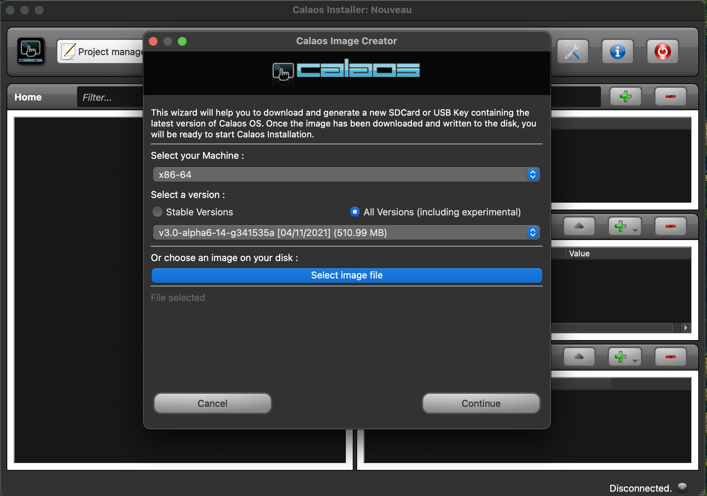

+++
title = ""
date = 2024-01-31T08:43:17Z
weight = 5
chapter = true
pre = "<b>X. </b>"
+++

### Bienvenue dans la documentation de Calaos

# Some Chapter title

La documentation couvre tous les sujets concernant l'installation, la configuration et l'utilisation de Calaos.

## Débuter
### Pré-requis

Pour installer Calaos, vous aurez besoin de:
- Un ordinateur, de type Intel
- avec un disque dur avec une capacité de 16GB minimum
- et 1GB Ram
- Un écran, clavier et souris
- Une clef USB de 4GB minimum pour l'installation

Pour commencer, téléchargez Calaos Installer a cette addresse : TODO lien vers Calaos installer. Ce dernier est compatible avec les systèmes d'exploitation Windows, Mac et Linux.
Une fois téléchargée, lancer l'application.

Choisir la dernier version stable de Calaos OS dans la liste déroulante, puis cliquer sur "Continuer".
L'image est alors téléchargée depuis le serveur de Calaos. Cette opération peut prendre quelques minutes et depends de la vitesse de votre connexion internet.
Une fois le téléchargement terminé, insérer une clef USB dans votre ordinateur. Celle-ci sera formatée et les fichiers de l'image seront copiés dessus.
La clé USB devrait apparraitre dans la fenêtre de l'application. Choisir la clé USB puis cliquer sur "Continue".

Une fois l'image copiée sur la clé USB, vous pouvez l'insérer dans le PC qui servira de serveur Calaos. Redémarrer le PC et booter sur la clé USB. L'installation de Calaos OS démarre alors.
Lorsque Calaos OS demarre vous avez deux possibilités:
- Utiliser Calaos OS en mode "Live" pour tester le système sans l'installer
- Installer Calaos OS sur le disque dur de votre PC

Le mode "Live" vous permettre de configurer votre systeme, de tester les fonctionnalités et de voir si tout fonctionne correctement. Si vous êtes satisfait, vous pouvez alors installer Calaos OS sur le disque dur du serveur. Vous garderez alors toutes les configurations que vous avez faites en mode "Live".

Lorsque le le mode "Live" a demarré, L'interface graphique de Calaos OS apparait sur l'écran. Vous pouvez alors configurer votre systeme, ajouter des I/O, des règles, des scénarios. Pour le moment l'interface est vide, mais nous allons voir comment la configurer.

Pour configurer votre installation vous avez besoin de Calaos Installer.
Lancer le logiciel sur votre PC, et commencer la configuration.

Vous pouvez creer une pièce, et donnez lui le nom que vous voulez.
Maintenant vous pouvez attacher une nouvelle I/O (Input/Ouput ou Entree/Sortie) a cette Piece.
Créeons par exemple une Sortie de type Lumiere.

### Installation
### Configuration
#### Creation d'une I/O
#### Creation d'une règle
#### Upload de la config
#### Test

## Materiel Supportés
### Automate Wago
#### Codesys
#### Modules entrées
#### Modules sorties
#### Modules DALI
#### Modules DMX
#### Mode dégradé

### KNX
### MQTT
### Zigbee
### Dali
### DMX
### OneWire
### WebIO
### GPIO
### Camera
### Music
### Audio Receivers

## Calaos Installer

### Create Rooms
### Create IOs
#### Internal variables
### Scenarios
### Time Scheduling
### Create Rules
### LUA Scripting
### Wago Configuration

## Calaos OS
### Installation
### Configuration
#### Network
#### Services
#### Logs
#### calaos_config
#### TouchScreen
#### Date/Time/Timezone
#### Language
#### e-mail

#### calaos_ddns
### Update
### Roll Back / Restore

## Examples of use
### 

## Calaos SW Stack
### Calaos Server
### Calaos Home
### Calaos Mobile
### Calaos WebApp
### Calaos config
### Calaos DDNS
